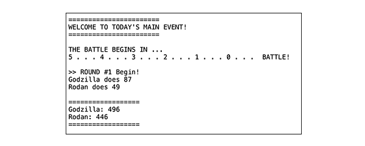

# Grand Canyon University Java Certificate Program
## Initial GitHub Exercise
GCU's Java 16-week program teaches students everything from the foundational understanding of the OOP language and takes them on a journey to advanced Full-Stack Java and React programs. This exercise is early in the program and shares the importance of code versions and collaboration. The code will be refactored and enhanced as new ideas and concepts are introduced.

This program and code can be used to grow your programming experience.  The code has the foundation to allow you to experiment with more advanced Java ideas.  Don't worry if you screw something up because you can make a new pull request and get the original code back. To further advance your marketable software development skills, fork the repository, and then create your enhancements locally.  Once you are satisfied, push then to your forked version and create your baseline code.

For a list of possible enhancements, scroll down to "Possible Enhancements."

## Concepts
- Static methods
- Classes and Objects
- Attributes
- While loop
- && (and)
- If/else if/ else
- println() vs print()
- Version control (git/GitHub)
- Collaboration

## Installation Instruction (IntelliJ)
1. Open IntelliJ
2. Select "Get from Version Control"
3. Paste in the URI from GitHub (https://github.com/RobertLoy/battle.git)
4. Click "Finish"

## Installation Instruction (Eclipse)
1. Open Eclipse
2. Click "File > Import"
3. Select "Git > Projects from Git (with smart import)"
4. Click "Next"
5. Click "Clone URI"
6. Click "Next"
7. Paste in the URI from GitHub (https://github.com/RobertLoy/battle.git)
8. Click "Next"
9. Click "Next"
10. Update the Directory where to install. Recommend to install in the eclipse-workspace in the appropriate workspace.
11. Click "Next"
12. Click "Finish"

## Possible Enhancements

### Basic
- Display the character's total points before the fight starts.
- Let the user name the monsters.
- Create a Battle class and move the battle() method to that new class.
- The countdown for battle start at 10 and countdown. Don't say "0", stop at "1".
- More coming soon! (submit your suggestions)

### Medium 
- Create a method on Monster that checks to see if it is alive and use that functionality instead of the code in the battle method().
- Encapsulate the Monster attributes of "name" and "hp" so the attributes cannot be accessed directly from other classes.
- Create an inheritance environment by adding a class called Hero and make a parent of both classes called Character. Add the appropriate attributes to each class.
- More coming soon! (submit your suggestions)

### Hard
- Using polymorphism add an attack() to the Monster, Hero, and Character classes with different messages for each class.
- Make Character class abstract and fix any code issues.
- Deploy the appropriate constructors for all the classes, and for at least the Monster, Hero, and Character classes.
- More coming soon! (submit your suggestions)

### Expert
- Create an array or arraylist of characters, and then create a menu of the characters from which the user can pick to battle.
- Allow the Monster and Hero to pick between battle() and heal(), with heal adding hp to the character instead of subtracting from the other character.
- Add unique methods for Monster called finishMove() that does 2x the normal damage and blessing() for Hero that does 2x heal.  Add those menu option to the monster actions,
- More coming soon! (submit your suggestions)

## For more information on GCU's Java Certificate
Java Programming Certificate
(https://www.gcu.edu/degree-programs/java-programming-certificate)
